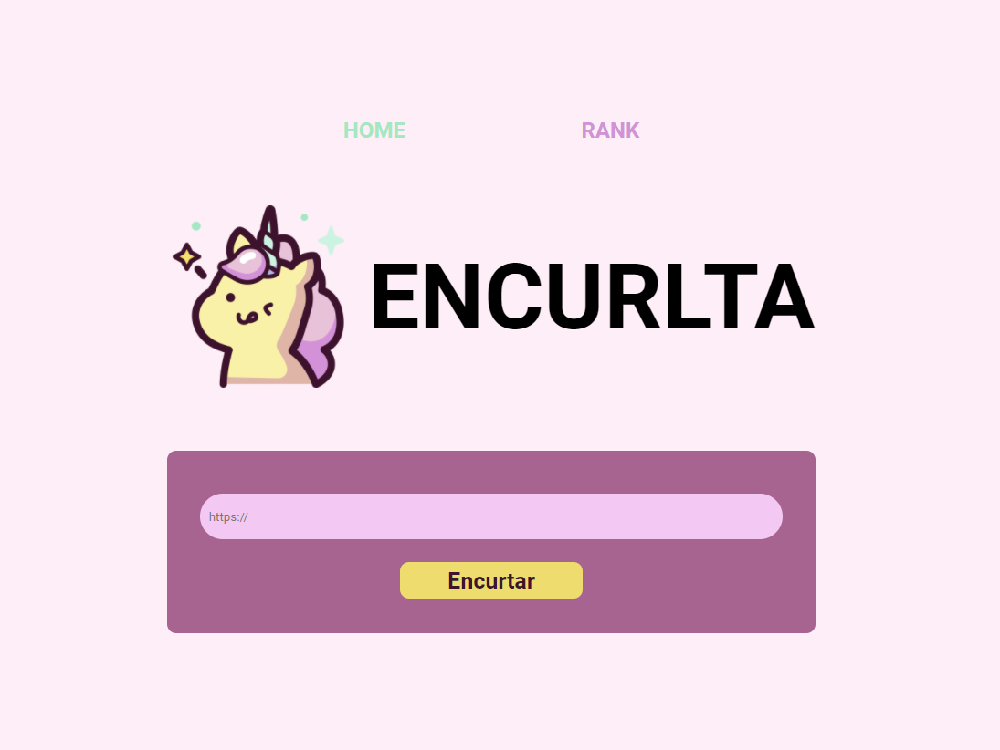

# Encurtador de URL - ENCURLTA

Esse encurtador de URL foi criado para colocar em prática os conceitos aprendidos de React, HTML, CSS, Javascript e Node JS. A partir disso, realizei a construção de ponta a ponta de uma aplicação web cujo o foco é o encurtamento de URLS. 

## Problema

Nas redes sociais, as postagens costumam ter um limite de caracteres. Por causa disso, influenciadores digitais precisam ser sucintos e passar uma mensagem de forma mais direta possível. Entretanto, muitas vezes é necessário a disposição de um Link na postagem que leve à um determinado produto, foto ou postagem. Esse link ocupa diversos caracteres e, por isso, prejudica a mensagem que os influenciadores irão passar ainda mais. Logo, encurtar a quantidade de caracteres de links torna-se uma tarefa essencial em um mundo onde menos é mais.

### Como utilizar

Para utilizar, você precisa fazer o download dos arquivos. Logo após isso, abra dois terminais dentro de "back-end" e "front-end". Assim que o fizer, instale as dependências necessárias para o projeto.

Por fim, pode utilizar o comando padrão para iniciar as aplicações:

<code>
    npm start
</code>
